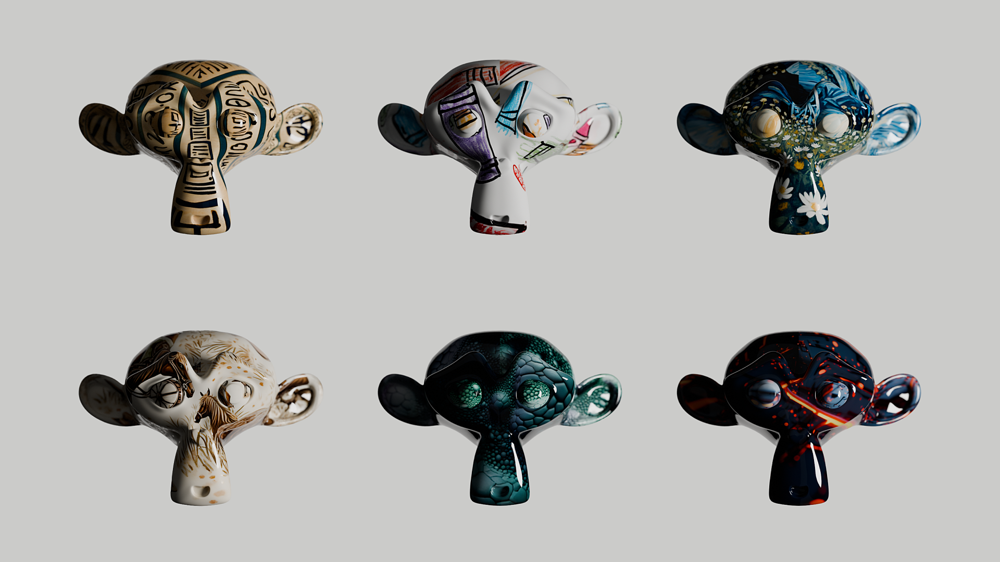

# AI Texture Generator for Blender

A Blender addon that allows you to generate textures using AI models (Stable Diffusion XL and Flux Pro) directly within Blender, powered by the Replicate API.

## Features

- Generate textures using text prompts
- Support for two AI models:
  - Stable Diffusion XL (SDXL)
  - Flux Pro
- Automatic material setup with:
  - Base color
  - Normal mapping
  - Roughness mapping
- Texture tiling controls
- Upscaling capabilities
- Material management system
- Progress tracking
- Multi-threading support

## Requirements

- Blender 4.0.0 or newer
- Internet connection
- Replicate API key ([Get one here](https://replicate.com))

## Installation

1. Download the addon files
2. In Blender, go to Edit > Preferences > Add-ons
3. Click "Install" and select the downloaded .zip file
4. Enable the addon by checking the box next to "Material: AI Texture Generator"

## Setup

1. Once installed, go to the addon preferences
2. Enter your Replicate API key
3. Choose your preferred save location:
   - Blender File: Saves textures within the .blend file
   - Next to Blender File: Saves textures as separate files in the same folder as your .blend file

## Usage

1. Select an object that can receive materials
2. Go to the Material Properties panel
3. Find the "AI Texture Generator" section
4. Enter a text prompt describing the texture you want
5. Adjust settings as needed:
   - Width/Height
   - Model-specific settings (SDXL or Flux)
6. Click "Generate Texture"

### Model Settings

#### SDXL Options
- Scheduler type
- Refine style
- Guidance scale
- Number of steps
- Prompt strength
- Watermark toggle

#### Flux Pro Options
- Aspect ratio
- Guidance strength
- Interval
- Safety tolerance
- Prompt upsampling
- Output format and quality

### Texture Management

After generation, you can:
- Adjust tiling (X/Y)
- Toggle normal mapping
- Toggle roughness
- Upscale textures
- Delete unwanted textures
- Assign textures to selected faces
- Switch between generated textures

## Tips

1. Save your Blender file before generating textures if using the "Next to Blender File" save option
2. More detailed prompts generally yield better results
3. Use the upscaling feature if you need higher resolution textures
4. The normal map and roughness features can be toggled after generation
5. Generated textures are automatically named based on the model used and prompt

## Troubleshooting

- If generation fails, check your API key and internet connection
- Ensure your Blender file is saved when using "Next to Blender File" save option
- Check the system console for detailed error messages
- Make sure you have an active object selected that can receive materials

## License

### Addon Code
Creative Commons Zero v1.0 Universal (CC0)

The creator of this work has dedicated it to the public domain by waiving all of their rights to the work worldwide under copyright law, including all related and neighboring rights, to the extent allowed by law.

You can:
- Copy, modify, distribute and perform the work
- Even for commercial purposes
- All without asking permission

For more information: https://creativecommons.org/publicdomain/zero/1.0/

### Third-Party Services

This addon uses the Replicate API, which has its own terms of service and usage requirements:
- You need your own Replicate API key
- Usage of the API is subject to Replicate's terms of service and pricing
- The models (SDXL and Flux Pro) have their own licensing terms
- API usage costs and rate limits apply

Please review Replicate's terms of service before using this addon:
https://replicate.com/terms

Note: While this addon's code is in the public domain, you are responsible for complying with Replicate's terms of service and any associated costs when using their API.

## Credits

Created by Temporary Studio INC
Powered by Replicate API

## Disclaimer

This software is provided "as-is" without any warranty of any kind, either expressed or implied. The author(s) and maintainer(s):
- Do not guarantee the software will meet your requirements
- Do not guarantee bug-free or uninterrupted operation
- Are not responsible for any costs, damages, or other liabilities arising from its use
- Do not provide official support or maintenance
- Are not responsible for any API costs or usage from Replicate

Use this software at your own risk. While we appreciate bug reports and suggestions through GitHub issues, we cannot guarantee:
- Response times
- Bug fixes
- Feature implementations
- Ongoing maintenance

The software may contain bugs and is still in development. Always backup your work before using this addon.

---
